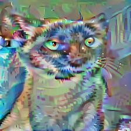

# Visualizing Convolutional Neural Nets

This project aims to study the kind of representations learned by ConvNets at different layers. The implementations in this project are based on the ideas presented in the papers:

1) Deep Inside Convolutional Networks: Visualising Image Classification Models and Saliency Maps by Simonyan et.al.

2) Understanding deep image representations by inverting them by Mahendran et.al.

## Visualizing Score based representations and Extracting Visual Saliency Maps

### Key concepts

This idea was presented in the paper **Deep Inside Convolutional Networks: Visualising Image Classification Models and Saliency Maps** by Simonyan et.al. The authors exlore the following two ideas:

1) What kind of representations are learned by CNN's when we talk about a particular classification score in the solftmax layer of any CNN ? This can be visualized by trying to learn an image from random noise which maximizes the class specific score in the CNN.

2) What is the contribution of individual pixels of any image in the final score achieved by the network? This is explored by extracting Visual Saliency maps by computing the derivative of the final score w.r.t to the input image (this can be done in a single backprop step). The authors also use the Visual Saliency Maps as an initialization tool for GraphCut segmentation which can be used for Object localization and detection. We do **not** explore this aspect of the saliency map in this implementation

### Running the Code

The code for this Visualization can be found in the file `Class_score_and_Saliency_Map_Visualization.ipynb`. It can be run in a top-down manner like any other IPython notebook.

### Idea Dump

I pretrain a `MobileNetV2` architeture on the `cats vs dogs` dataset and then learnt the Visualizations. Would it be better to directly optimize over the learnable image using one of the imagenet class scores rather than pretraining the model

### Results

[WIP]

## Visualizing convnet representations by Inverting them

### Key concepts

This idea was presented in the paper **Understanding deep image representations by inverting them by Mahendran et.al.** by Mahendran et.al. The authors exlore the following idea:

What kind of representations are learned by CNN's at different convolutional blocks? This is explored by trying to invert the representations of a test image at different layers of the network. This can provide us with alternate forms of the same image that can have similiar representations for the ConvNet. This alternative formulation helps us visualize the kind of images that are sufficient to form meaningful representations at different layers of the network.

The inversion procedure involves the following steps:

1) Randomly initialize an image.
2) Compute the reconstruction loss between the representation of the actual image and the random image at a layer l.
3) Update the random image by backproping though it using any standard optimizer.

### Running the Code

The code for this Visualization can be found in the file `Inverting_convnet_representations.ipynb`. It can be run in a top-down manner like any other IPython notebook.

I use a pretrained VGG16 network for Visualization at various levels of the network.

### Results

**Original Image**:

**Reconstructed Images**:

<table>
<tr>
<td>
Block3 Conv1

</td>
<td>
Block3 Conv2

</td>
<td>
Block3 Conv3

</td>
</tr>
<tr>
<td>
Block4 Conv1

</td>
<td>
Block4 Conv2

</td>
<td>
Block4 Conv3

</td>
</tr>
<tr>
<td>
Block5 Conv1

</td>
<td>
Block5 Conv2

</td>
<td>
Block5 Conv3

</td>
</tr>
</table>

## Conclusion

1) Inverting the image representations clearly show that as we move down a deep hierarchical model like the VGG16 convnet, the representations become more abstract with the network discarding most of the finer level details in the image and considering only higher level features like shape, eyes, ears etc.

2) Visualizing the Image Saliency Maps clearly shows the main image pixels being responsible for the classfication score assigned by the network. This is somewhat obvious and is expected.

3) Updating the image representation by maximizing the image score does not give any clear representations in my implementation at convergence but this might be due to fine tuning the network and not optimizing the image net score. This is possible since the convnet layers are freezed when pretraining the network.
